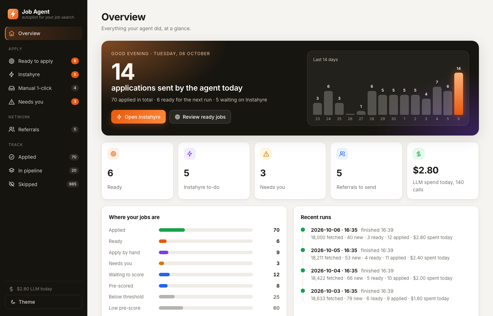
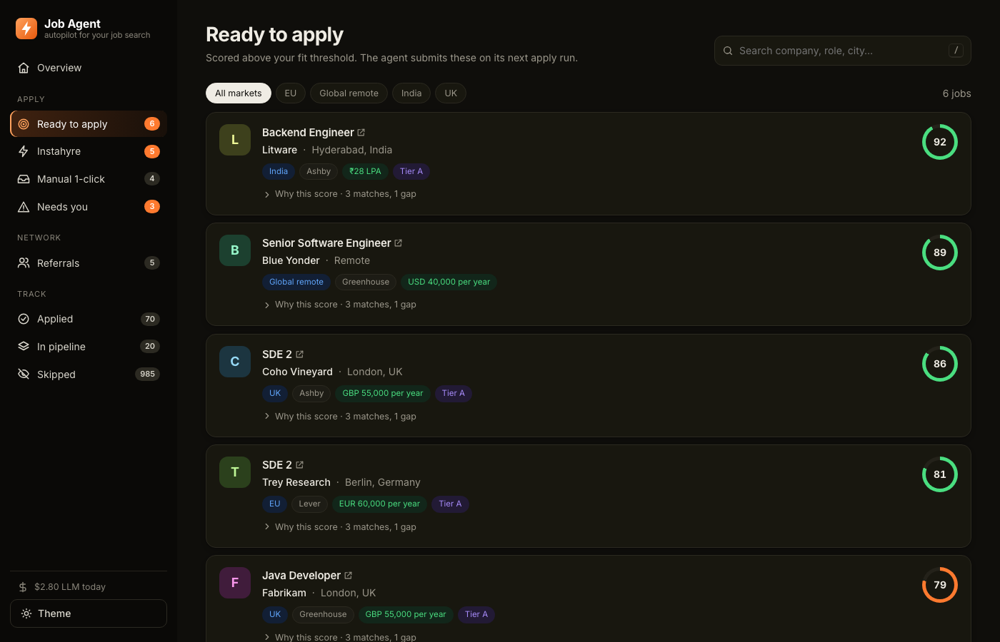
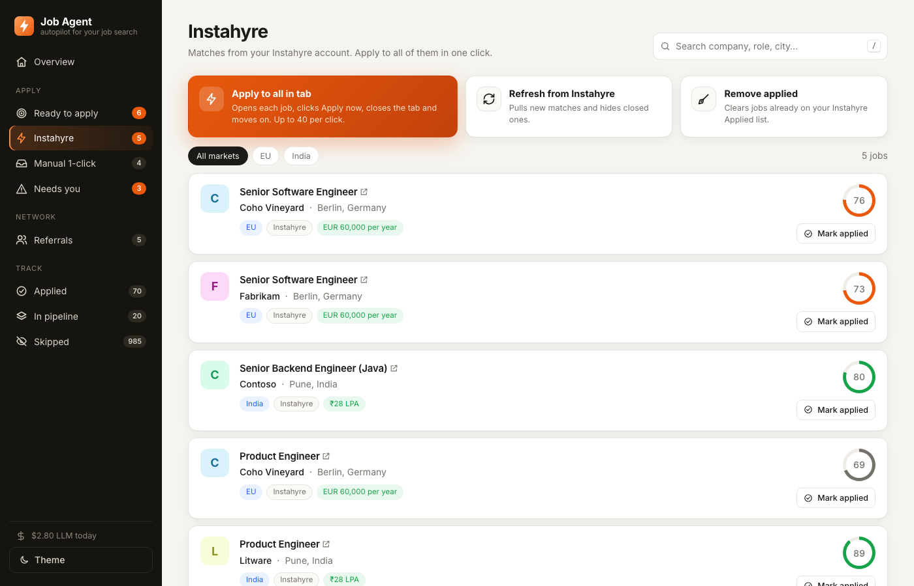
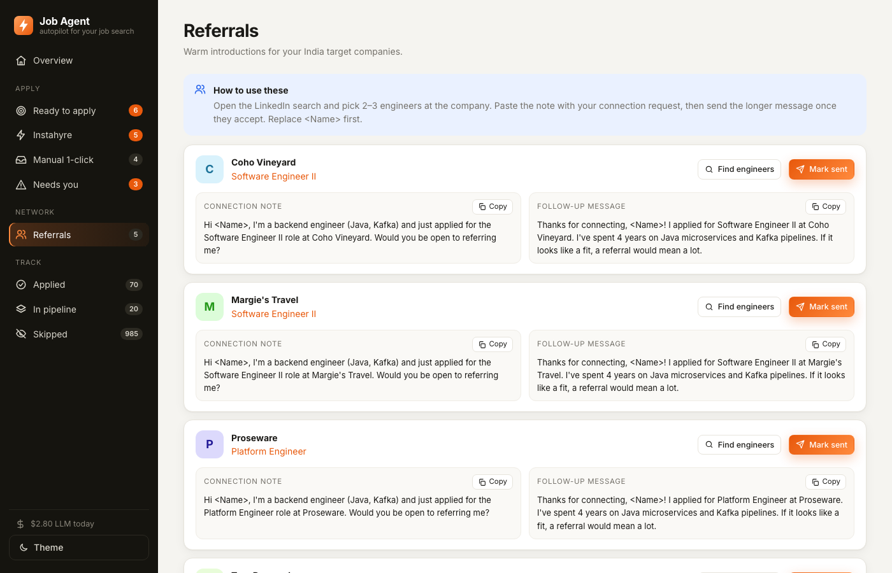

# Job Agent

A local job-search autopilot. It finds backend roles on company career boards, filters them by title, market and salary, scores each one against your resume with Claude, applies to the strong matches, and tracks everything in a small dashboard.



## What it does

- **Discovers** jobs from Greenhouse, Lever and Ashby boards for a list of companies you choose, plus LinkedIn and Naukri job-alert emails (read-only IMAP).
- **Filters** by title rules, market (India, remote, UK, EU and others), experience required and salary floors.
- **Scores** each job with Claude: a cheap Haiku pre-score, then a Sonnet fit score with reasons and gaps. A daily budget caps LLM spend.
- **Applies** to Greenhouse jobs above your fit threshold, answering only from your profile and resume. Anything it cannot answer truthfully is left for you under *Needs you*.
- **Instahyre**: reads the matches in a hidden browser using your saved Instahyre session (a window opens only when you need to sign in) and, on one click, opens each job, presses Apply, and moves on.
- **Referrals**: drafts LinkedIn connection notes and follow-ups for target companies. You send them yourself.
- **Dashboard**: a local web app with an overview, job queues, search, market filters, and light and dark themes.

| Ready to apply (dark) | Instahyre | Referrals |
|---|---|---|
|  |  |  |

## Try the dashboard with fake data

```bash
uv sync
uv run python scripts/demo.py
# open http://127.0.0.1:8778
```

The demo builds `data/demo.db` from made-up companies and jobs, so nothing personal is needed.

## Setup

Requirements: Python 3.12, [uv](https://docs.astral.sh/uv/), and the [Claude Code](https://claude.com/claude-code) CLI signed in (scoring runs through `claude -p`).

```bash
uv sync
uv run playwright install chromium
cp config/examples/*.yaml config/
```

Then edit the files in `config/`:

| File | What goes in it |
|---|---|
| `profile.yaml` | Your contact details, location, notice period, work authorisation, expected salary and resume PDF path |
| `master_resume.yaml` | Your resume as structured bullets. The agent only ever uses facts from here |
| `settings.yaml` | Title rules, markets, salary floors, thresholds, daily caps and the LLM budget. `live: false` keeps applying in dry-run |
| `companies.yaml` | The career boards to watch (`platform` and board `token`) and a tier per company |

Your real `config/*.yaml` files are git-ignored. For alert emails and Greenhouse security codes, put a Gmail app password in `.env` (read-only IMAP):

```
GMAIL_APP_PASSWORD=xxxx xxxx xxxx xxxx
```

## Usage

```bash
uv run jobagent run              # discover, filter and score
uv run jobagent apply --dry-run  # fill forms without submitting
uv run jobagent apply            # submit ready jobs (needs live: true)
uv run jobagent instahyre        # read Instahyre matches (sign in once in the window that opens)
uv run jobagent referrals        # draft referral messages
uv run jobagent manual-refresh   # hide LinkedIn/Naukri jobs you applied to (from confirmation emails) or that expired
uv run jobagent questionnaires   # read Instahyre inbox questionnaires and draft answers for review (submits nothing)
uv run jobagent questionnaires --submit <id>   # submit one reviewed draft (the dashboard Questionnaires tab does this)
uv run jobagent dashboard        # http://127.0.0.1:8777
uv run jobagent check-companies  # verify every board responds
```

`scripts/daily.sh` runs the whole pipeline and can be scheduled with launchd or cron.

## Safety rules

- **Truthful answers only.** Answers come from your profile and resume. Unknown questions are never guessed. The job goes to *Needs you*.
- **Stops on challenges.** Any CAPTCHA, Cloudflare check or sign-in wall stops the run. There is no stealth or bypass tooling.
- **No LinkedIn or Naukri automation.** Alert jobs are listed for you to apply to by hand.
- **Caps everywhere.** Daily and per-company application caps, a pause between submissions, and a daily LLM budget.
- **Kill switch.** Create a file named `STOP` in the project root to halt any run.
- **Local only.** Your data lives in `data/agent.db`. Credentials are read from the environment and never stored.

## Development

```bash
uv run pytest -q
```

Tests run against `config/examples/`, so they pass on a fresh clone.

## License

MIT
